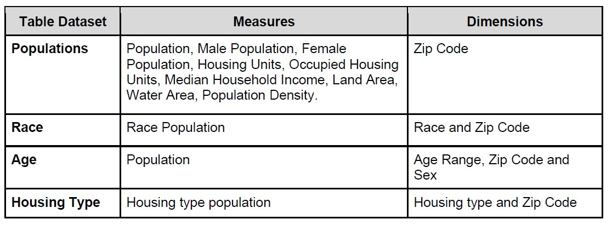
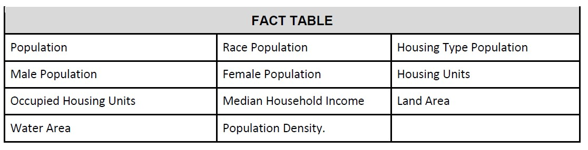

# Inclusionary Housing in Reno: Nursing Facilities and College Housing

# Executive Summary

Our audience consists of the Reno City Council, Reno Housing Authority, Reno residents, particularly seniors and college students, Local Non-profit organizations, Developers/Contractors, and Mayor Hillary Shieve. Our audience cares about the fair representation of residents in the election process of Reno City Council Members, which requires them to take action to build inclusionary housing for college students and nursing facilities throughout Reno. The benefits of acting include oversight in the development of district maps, housing for the largest demographic groups, and equitable representation throughout the city. If no action is taken, the legislative body would determine districts without regard to communities of interest, potential gerrymandering, minority group voter suppression, discredit to the government institution, and perpetuate the housing crisis. Building strategic inclusionary housing for the two largest demographic groups in Reno will equalize voter representation throughout the city.

# Data

The following is a summarized list of the dimensions and measures from the dataset used on this project:

A more detailed presentation of dimensions and measures can be found in the Data Dictionary for this dataset located in the Appendix. The Fact Table of the data set used on this project consists of the following table:

The above Fact Table has a grain that gives us the amount of population by race, sex, housing type, housing unit status, Income, and density. The Dimensions Table of the data set used on this project consists of the following: Zip Code, Race, Age range, Age range by Sex, and Housing Type.

# Research

Our research started with the Reno City Council wards and ended in Reno housing types per zip code. Beginning with the city wards, the group attempted to find the correct demographic data for each ward in an effort to answer the beginning research question; what are the demographic shifts from the 2010 census data to the 2020 census data used to calculate the Reno City Council electoral ward map? (Appendix 3) Unfortunately, the data needed for this specified question was unable to be found in the census data. The city wards’ demographics were obtainable, but the geographic data needed to understand the mapping and potential redistricting was out of reach.

With the discovery of the ward and census data being inaccessible, we shifted to Reno zip code demographic data. Thus, changing the research question to, what are the communities of interest in Reno based on zip codes? (Appendix 5) The new research question created the need for exploration into the communities of interest found in the Reno zip code demographic data. The communities of interest were race, age, housing type, employment status, education, and household income. Each community was thoroughly examined to find inequalities or patterns throughout the zip codes (Appendix 5).

The race was found to be equally dispersed in each zip code, meaning that the populations of each race were similar enough in each zip code to be considered evenly represented. Even with the abundance of one race over the others, the overall trend is even. The trend of the white population being so much higher than the others is the same from total population to individual zip code population, as seen in Figure 1 and Figure 2.

